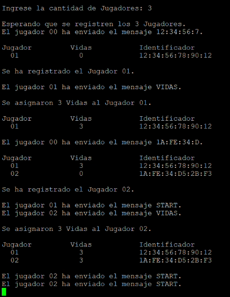
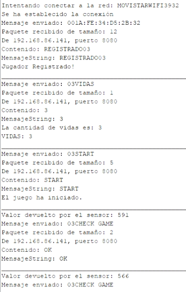
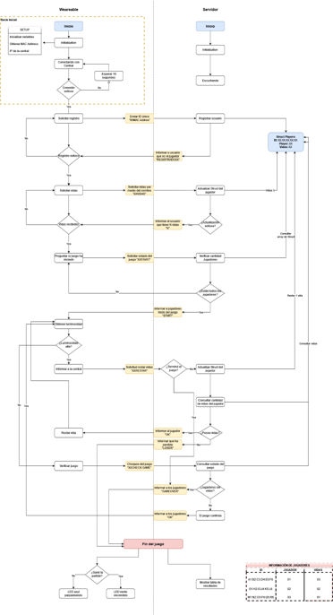

## Description

Project developed with **Raspberry Pi 3** in **C, C++** programming language with **Socket-** communication protocol to control the game by projecting the information on the **Arduino** console and the Server **Terminal.**

In this project, the **ESP8266 DSKEP-12** platform is used as a wearable and a **Raspberry Pi** as a Server, in order to carry out a war game where the player will have the wearable, which will respond to light, attached to his clothing, and This will establish communication through the socket protocol to the Raspberry Pi, which will act as a server, being in charge of controlling and supervising the dynamics of the game.

## Game Mechanics

The game is based on the “Message-Response” premise, where the Server is constantly listening and responding to Messages received from different players. The connection is established through the socket protocol, being all in the same Wi-Fi network.

**Initialization**

On the Server side, once the program is started and executed, it asks the administrator to enter the number of players. Once the number of players has been entered, the Server waits for the indicated amount to be registered.

In wearables, the initialization includes the Wi-Fi connection of each one of them. Until they connect to Wi-Fi, the wearable's LED will remain on red and once it connects, the LED will turn on green. Once connected to Wi-Fi, the wearables will try to establish a connection with the server. Once they succeed, they will change their LED to blue and the exchange of messages will begin.

**Player Registration**

To register, each Player sends a message consisting of a "00" followed by the MAC of the device, which will be its identifier. The 00 will serve to distinguish the log message from the rest of the messages.

On the Server side, upon receiving the registration message, the identifier will be saved in an array of "Player" structures, a specially defined structure where the identifier (MAC), the player number (assigned by the server) and the number of lives. The Player number will be assigned incrementally as players register. Once the player is registered on the Server, the Server sends him a message to indicate that he has already registered and to indicate his player number (the message will have the form “NNREGISTRED”, where NN will be the Player number ). Upon receiving said message, the player will save the Player Number, which will be the one used to send messages later.

**Request for lives**

When the player has already registered, he will send another message to request lives. The message will consist of the previously assigned player number, followed by the word “LIVES”. Upon receiving this message, the Server will look up the player by their number in the array, update the value of the number of lives they have been set to in the game, and reply to the player with the number of lives assigned. The Server will remain listening until all players have requested lives to start the game.

**Start of the game**

Once the player has been assigned lives, he will start asking the Server if he can start the Game, sending a message of the form “NNSTART”, where NN is the player number. The Server will not respond until all Players have registered and requested lives. Players will continue to send "NNSTART" until they receive a response from the Server. If the server already has all the players registered and with assigned lives, then it will return a “START” message to the players, indicating that the game begins and they can start taking light values.

**Game in progress**

Started the game, all the wearables begin to take luminosity values. If the luminosity value exceeds a certain set limit then the player will report to the Servitor that they have been hit in order to have one life subtracted. It will do this by sending a message of the form “NNRESTAR”. The Server will take this message and, after checking that the game has not ended (because another player has run out of lives), will update the value of the number of lives in the structure array and check if the player has run out of lives. . If he still has lives, he will respond with an “OK” to indicate to the player that the game continues.

On the contrary, if he has run out of lives, he will reply “LOSER”, indicating that he has lost. If "OK" is received, the player will update their internal life value and continue to take luminosity values. If the luminosity value does not exceed the established limit, then the Player will check the state of the game by sending “NNCHECK GAME”. Given this message, the Server will check if any other player has lost and will return "OK" if he has not lost anyone or "GAMEOVER" if he has. If "OK" is received, the player will continue taking luminosity values.

**End of the game**

The Server will end the game once it detects that any player has run out of lives. This check, as mentioned above, can be done when a player subtracts lives (“REST”) or when a player checks the state of the Game (“CHECKGAME”). As it responds, either with "LOSER" or "GAMEOVER", the Server unregisters the Players. If they all unregistered, then it displays the final leaderboard and ends its execution.

On the player's side, if he receives the end of the game by the message “LOSER” (he has lost), then the blue LED starts flashing to indicate that he has lost. If he receives "GAMEOVER" he turns on his green led to indicate that he has not lost.

Next, the logic of development is illustrated by means of a flowchart.

## Devices used

* Raspberry Pi 3
* ESP8266 microcontroller
* RGB LED
* LDR photoresistor

For more details, go to the specific project folder: /images

## Authors

**Alejandro Martinez**

* [LinkedIn](https://www.linkedin.com/in/diego-alejandro-martinez-espinosa-571086134)

**Francisco Lupi**

* [LinkedIn](https://www.linkedin.com/in/francisco-martin-lupi)

## Screenshots 

  

## Installation

This project requires to be installed on a **Raspberry Pi 3** and to use the aforementioned **Sensors** with their respective connections.

## Feedback

If you have any feedback, please reach out to us at dreamstime@outlook.es
